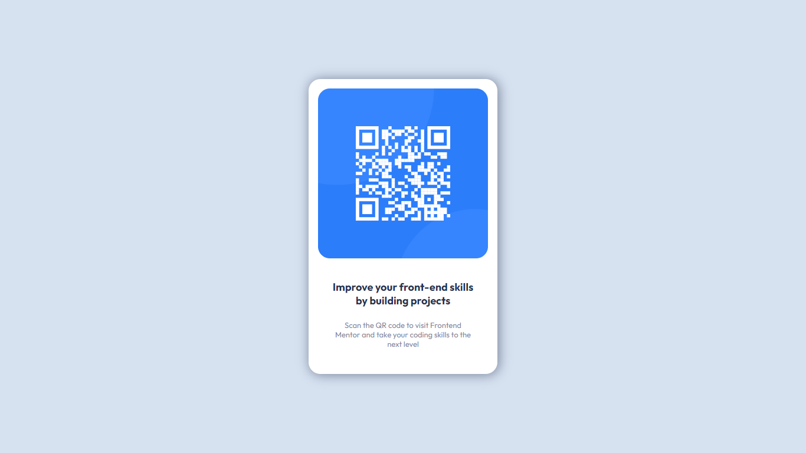

# Frontend Mentor - Solução de componente de código QR

Esta é uma solução para o desafio do componente de código QR no Frontend Mentor . Os desafios do Frontend Mentor ajudam você a melhorar suas habilidades de codificação criando projetos realistas.

## Índice:

- [Visão geral](#overview)
  - [Screenshot](#screenshot)
  - [Links](#links)
- [Meu processo](#Meu-processo)
  - [Construído com](#Construído-com)
- [Author](#author)

### Screenshot:

### Links:

[Live site URL here](https://deyvesu.github.io/qr-code-component-main/)

## Meu processo:

### Construído com:

- Semantic HTML5 markup
- CSS custom properties
- Flexbox

## Author:

- Website - [Deyve](https://github.com/Deyvesu)
- Frontend Mentor - [@Deyvesu](https://www.frontendmentor.io/profile/Deyvesu)
- Twitter - [@Anteikhu_D](https://twitter.com/Anteikhu_D)

